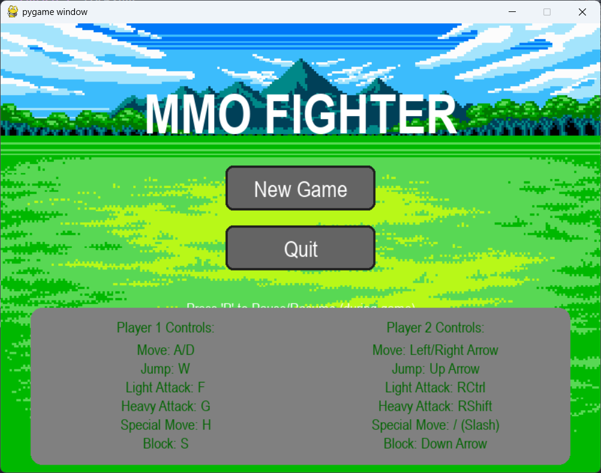
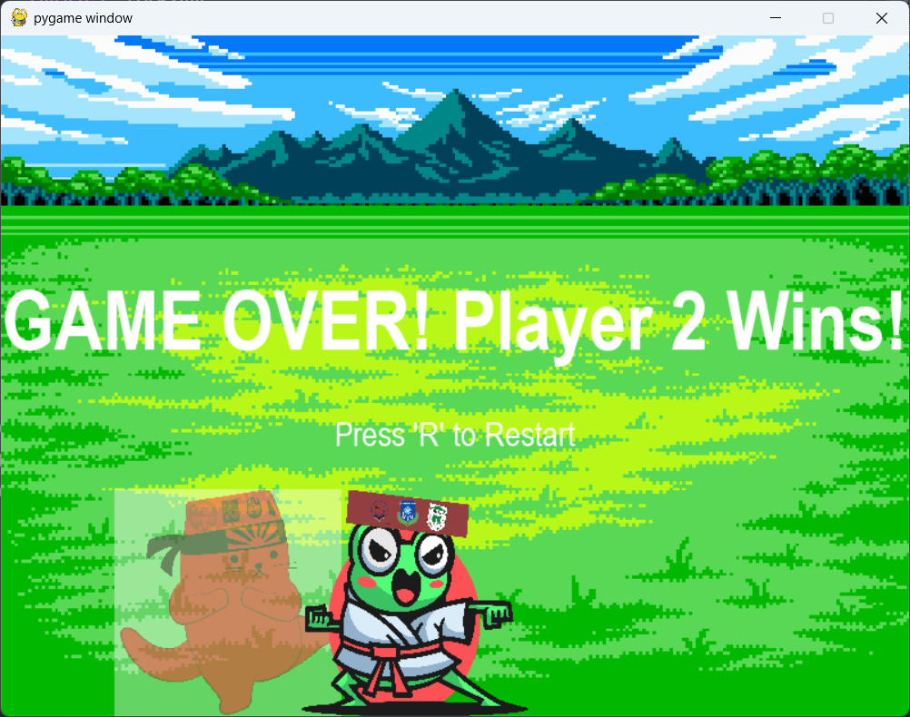

# 🥋 MMOFighter

> A fun and competitive **2-player fighting game** made using **Pygame**.

[](https://youtu.be/EHMZdChD20c)
<p align="center">
  <a href="https://youtu.be/EHMZdChD20c" target="_blank">▶ Watch Demo</a>
</p>

---

## 🎮 About the Game

**MMOFighter** is a thrilling local multiplayer fighting game where two players battle it out in real time. Designed with classic arcade-style combat in mind, it's perfect for quick matches and testing your reflexes with a friend.

---

## 🛠️ Tech Stack

- 🐍 Python 3
- 🎮 Pygame Library

---

<details>
<summary>📦 Installation</summary>

```bash
# 1. Clone the repository
git clone https://github.com/yourusername/MMOFighter.git
cd MMOFighter

# 2. (Optional) Create a virtual environment
python -m venv venv
source venv/bin/activate  # On Windows: venv\Scripts\activate

# 3. Install dependencies
pip install -r requirements.txt

# 4. Run the game
python main.py
```
</details>


---

## 🎮 How to Play

🧑‍🤝‍🧑 **2 Players, 1 Keyboard – Let the brawling begin!**

### 🕹 Player Controls

| Action      | Player 1         | Player 2         |
|-------------|------------------|------------------|
| Move Up     | `W`              | `↑ Arrow`        |
| Move Down   | `S`              | `↓ Arrow`        |
| Move Left   | `A`              | `← Arrow`        |
| Move Right  | `D`              | `→ Arrow`        |
| Attack      | `F`              | `K`              |

🏆 **Goal:** Knock out your opponent by landing hits and draining their health bar!

---

## 🖼 Screenshots

> 

<p align="center">
  
  &nbsp;
  
</p>

---

## 📁 Project Structure

```bash
MMOFighter/
├── assets/              # Sprites, sounds, backgrounds
├── main.py              # Main entry point
├── game.py              # Game loop and scene handling
├── player.py            # Player movement, attack logic
├── utils.py             # Helper functions/utilities
└── README.md            # This file

